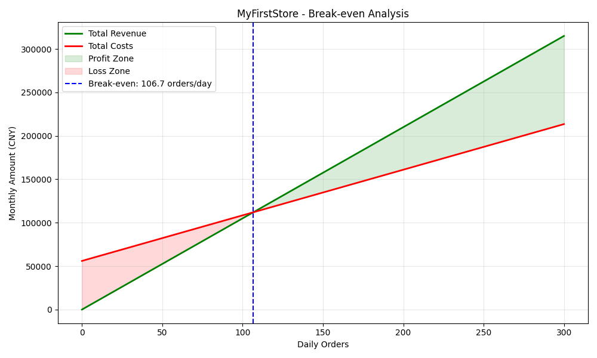

# MyFirstStore - 商业可行性分析报告
> 报告生成日期: 2025-08-07

## 核心财务指标
| 指标 | 数值 |
|:---|:---|
| 日均单量 | **104** |
| 客单价 | **35.00 元** |
| 月均净利润 | **-1,788.89 元** |
| 净利率 | **-1.64%** |
| 毛利率 | **65.00%** |
| 投资回收期 | **无法回收** |

## 关键决策建议

## 本量利分析

## 利润敏感性分析
关键变量提升10%对月净利润的影响：

| 关键变量 | 利润变化百分比 |
|:---|:---|
| 食材成本率 | +183.13% |
| 月人力成本 | +167.70% |
| 月租金 | +111.80% |
| 平台佣金率 | +91.57% |
| 客单价 | +17.61% |