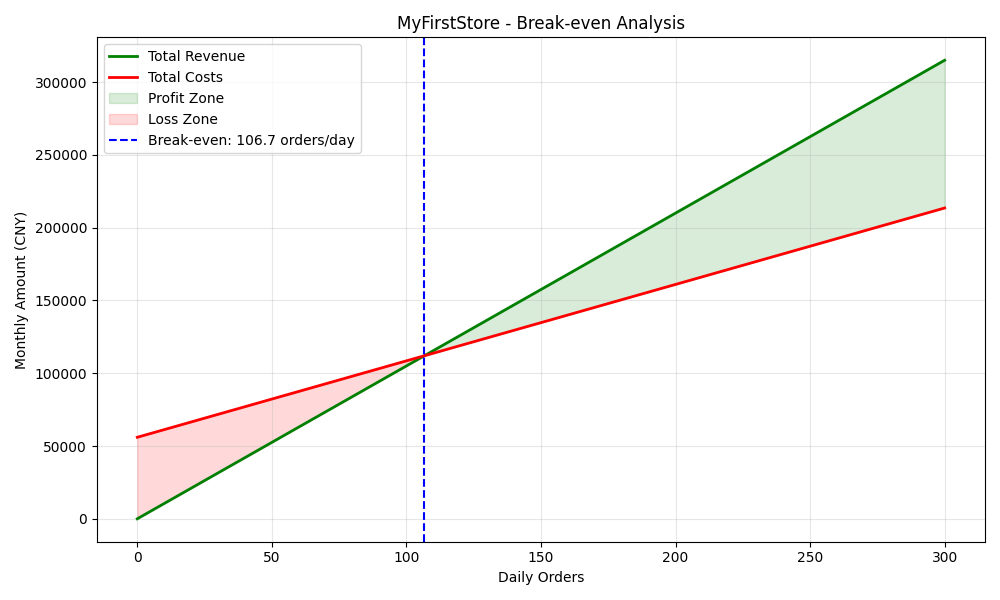

# MyFirstStore - Business Feasibility Analysis Report
> Report GenerationJapanesePeriod: 2025-08-07

## Core Financial Metrics
| IndicatorMark | NumberValue |
|:---|:---|
| JapaneseAverageSingleEdition | **104** |
| Average Ticket Price | **35.00 CNY** |
| Monthly Net Profit | **-1,788.89 CNY** |
| PureLiRate | **-1.64%** |
| Gross Margin | **65.00%** |
| Payback Period | **NoMethodReturnReceive** |

## Key Decision Recommendations

## BookEditionLiAnalysis

## Profit Sensitivity Analysis
Impact on monthly net profit after a 10% increase in each key variable: 

| Key Variable | Profit Change Percentage |
|:---|:---|
| Ingredient Cost Ratio | +183.13% |
| Monthly Labor Cost | +167.70% |
| Monthly Rent | +111.80% |
| Platform Commission Rate | +91.57% |
| Average Ticket Price | +17.61% |